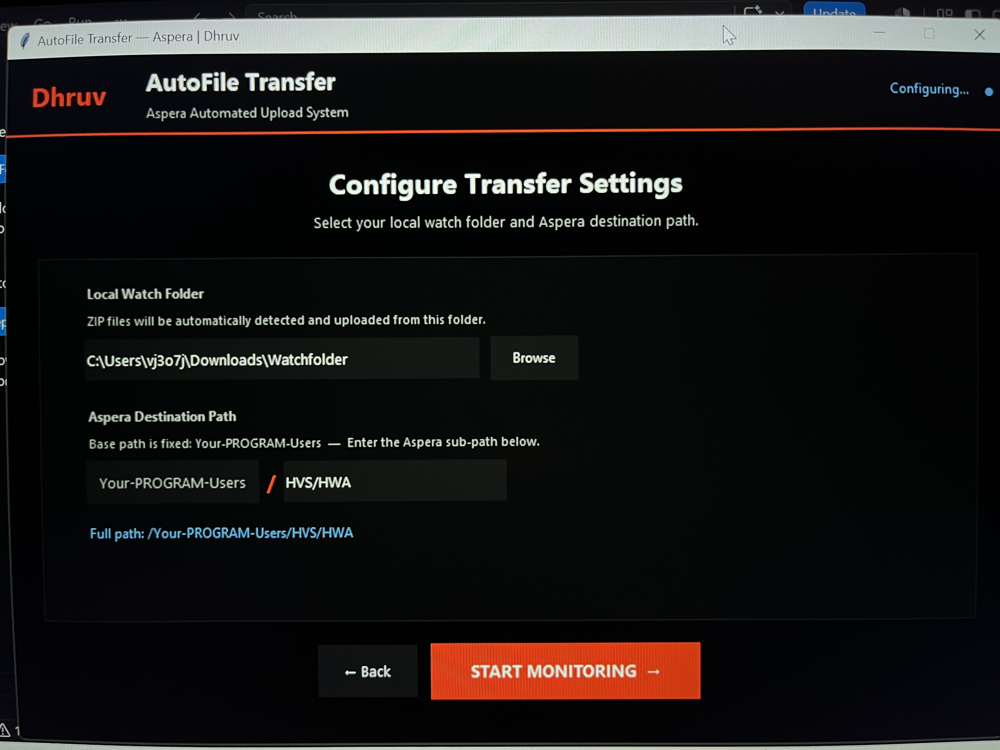
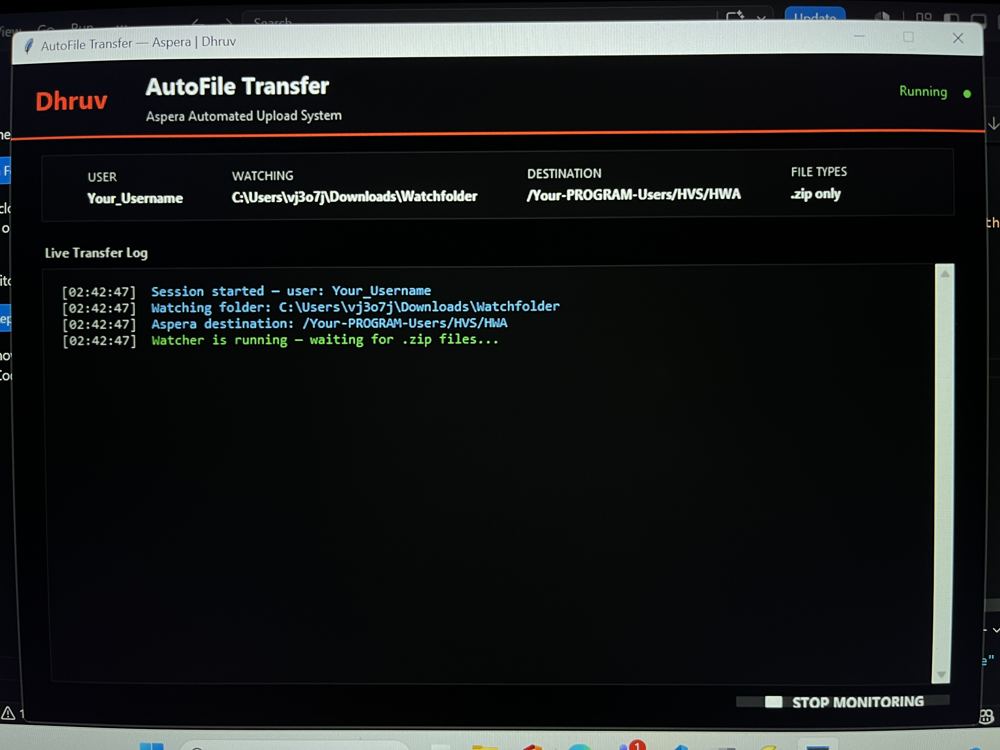

# AutoFile Transfer — Aspera Automated Upload System


A professional Python desktop automation tool that monitors a local folder **24x7** and automatically uploads files to **IBM Aspera** cloud storage — with zero human effort.

---

## What It Does

Right now, engineers manually upload log files to IBM Aspera after every test execution — opening the browser, logging in, navigating folders, uploading. This tool eliminates that entirely.

Once running, the tool:
- Detects new `.zip` files the moment they appear in a watched folder
- Waits intelligently for file compression to complete (file size stability check)
- Uploads automatically to the configured Aspera cloud path
- Deletes the local file after confirmed successful upload
- Logs every action with timestamp to a local log file

---

## Features

- **Professional dark UI** built with Tkinter — 3 screen flow (Login → Config → Dashboard)
- **Secure credential handling** — password never stored, only kept in memory for the session
- **File size stability check** — waits for zip compression to fully complete before uploading (no 0 KB errors)
- **Multithreaded uploads** — multiple files upload simultaneously without blocking each other
- **Thread-safe processing lock** — prevents the same file from uploading twice
- **Live color-coded log window** — see every action in real time
- **Stop / Start monitoring toggle** — pause and resume without restarting
- **Persistent log file** — full audit trail saved to `upload_log.txt` in watch folder
- **Auto folder creation** — if destination path does not exist on Aspera, it is created automatically
- **Configurable watch folder** — select any local folder via Browse button
- **Configurable Aspera path** — enter only the sub-path, base path is fixed

---

## Screenshots


| Login | 
|-------|
|| 

| Configuration |
|---------------|
||

| Dashboard |
|-----------|
|| 

---

## Tech Stack

| Technology | Purpose |
|---|---|
| Python 3.10+ | Core language |
| Tkinter | Desktop UI |
| Watchdog | Folder monitoring |
| Pillow | Logo rendering |
| IBM Aspera CLI (ascli) | File upload to Aspera |
| Ruby 3.4+ | Required to run ascli |
| Threading | Concurrent file uploads |
| Subprocess | CLI integration |
| Logging | Audit trail |

---

## Prerequisites

| Software | Version | Purpose |
|---|---|---|
| Ruby + Devkit | 3.4.9-1 (x64) | Required to run ascli |
| Aspera CLI | 4.25+ | Upload files to Aspera |
| Python | 3.10+ | Run the tool |
| VS Code | Latest | Run and edit the script |
| watchdog | Latest | Monitor local folder |
| Pillow | Latest | Render logo in UI |

---

## Installation

### Step 1 — Install Ruby + Devkit

Download **Ruby+Devkit 3.4.9-1 (x64)** from https://rubyinstaller.org/downloads

Run the installer → Next → Next → Install → Finish

When Msys2 window opens at the end → type **3** and press Enter

Verify:
```cmd
ruby --version
```

---

### Step 2 — Install Aspera CLI

```cmd
gem install aspera-cli
```

Install ascp engine:
```cmd
ascli config ascp install
```

Verify:
```cmd
ascli --version
```

---

### Step 3 — Install Python

Download from https://www.python.org/downloads

> **Important:** Check **Add Python to PATH** during installation

Verify:
```cmd
python --version
```

---

### Step 4 — Install Python Libraries

```cmd
pip install watchdog
pip install Pillow
```

---

### Step 5 — Configure the Tool

Open `AutoFileTransfer.py` and update these lines:

```python
ASCLI_CMD    = r"C:\Ruby34-x64\bin\ascli"        # path to ascli on your machine
ASPERA_URL   = "https://your-aspera-server.com"   # your Aspera server URL
ASPERA_BASE  = "YOUR-BASE-PATH"                   # your Aspera base folder
```

---

### Step 6 — Run the Tool

Place `AutoFileTransfer.py` and `logo.png` in the same folder, then run:

```cmd
python AutoFileTransfer.py
```

---

## How to Use

**Screen 1 — Login**
Enter your IBM Aspera username and password. Credentials are never stored.

**Screen 2 — Configuration**
- Click **Browse** to select the local folder to watch
- Enter the Aspera sub-path (base path is fixed, only enter the sub-folder)
- Full path preview updates live as you type
- Click **START MONITORING**

**Screen 3 — Dashboard**
- Live color-coded log shows all activity in real time
- Green = success | Blue = info | Orange = deleted | Red = failed
- Click **STOP MONITORING** to pause — button turns green
- Click **START MONITORING** to resume

---

## How It Works

```
Login with Aspera credentials
        ↓
Select local watch folder + Aspera destination
        ↓
Watcher monitors folder 24x7
        ↓
New .zip file detected
        ↓
File size stability check (waits for compression to complete)
        ↓
Upload to Aspera via ascli
        ↓
SUCCESS → Delete local file + log entry
FAILED  → Keep local file + log error
        ↓
Wait for next file...
```

---

## Concurrent File Handling

| Scenario | Behaviour |
|---|---|
| 2 files arrive at same time | Each gets own thread — both upload simultaneously |
| File B arrives while File A uploading | File B starts in new thread immediately |
| Same file detected twice | Processing lock skips duplicate automatically |
| Upload fails | File kept safely in local folder — never deleted |

---

## Log File

Every action is recorded in `upload_log.txt` inside your watch folder:

```
2026-03-24 10:15:32 - INFO - Session started | user: john
2026-03-24 10:15:32 - INFO - Watcher started | folder: C:\Watchfolder
2026-03-24 10:18:45 - INFO - Upload started | user: john | file: test.zip
2026-03-24 10:18:50 - INFO - Upload SUCCESS | user: john | file: test.zip
2026-03-24 10:18:50 - INFO - File deleted from local | file: test.zip
```

---

## Troubleshooting

| Issue | Cause | Solution |
|---|---|---|
| Upload FAILED 401 | Wrong credentials | Restart tool and re-enter credentials |
| ascli not recognized | ascli not in PATH | Use full path: `C:\Ruby34-x64\bin\ascli` |
| 0 KB file error | File still compressing | Tool handles this automatically with stability check |
| watchdog error | Library not installed | Run: `pip install watchdog` |
| Logo not showing | logo.png not in same folder | Place logo.png next to AutoFileTransfer.py |
| gem install SSL error | Corporate network blocking | Download gem file on another machine and install locally |

---


## Author

**Dhruv** — Software Engineer
- Built for automating ADAS log file uploads to IBM Aspera cloud storage
- Eliminates 100% of manual file transfer effort per test execution

---

## License

MIT License — feel free to use and modify for your own projects.
